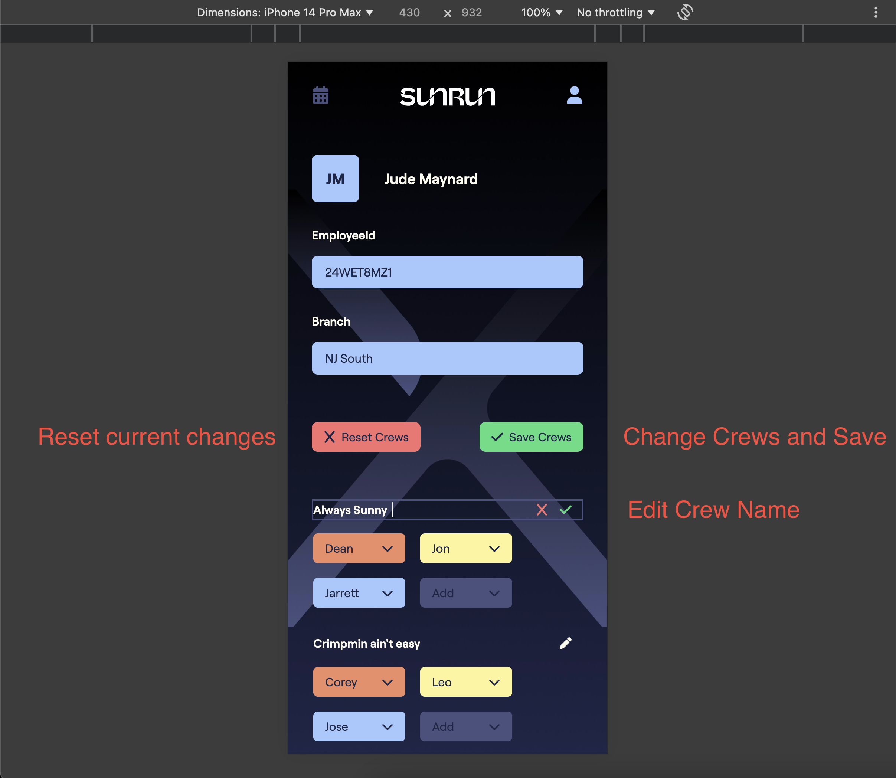
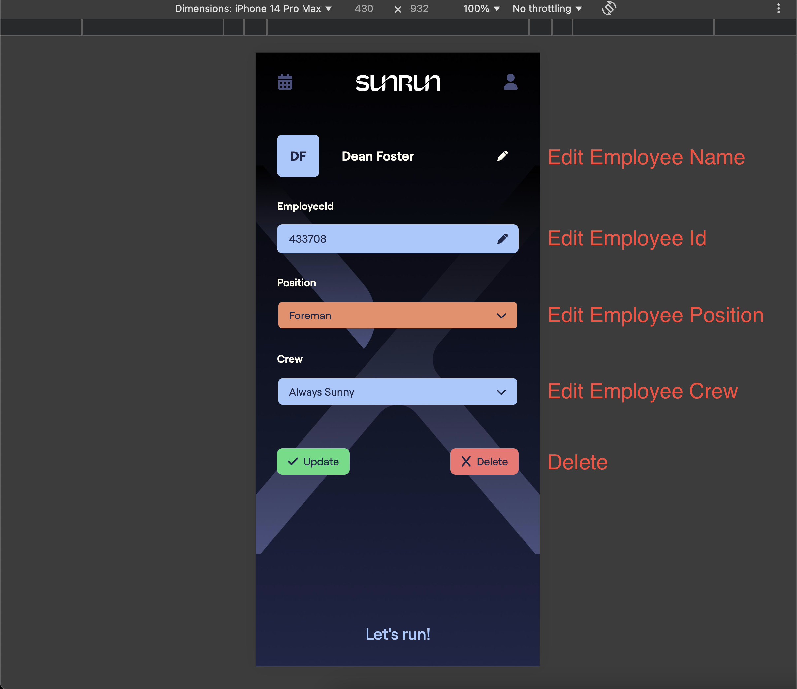

# Back-end

## Data

### Data Tree

Sunrun -> Branches -> Manager; Employees; Saturdays;

```txt
Sunrun
  - Branch
    - Manager
    - Employees
    - Saturdays

Sunrun
  - NJ South
    - Jude Maynard
    - Employees
    - Saturdays
```

### Data Example

```json
{
  "67195c86dc38b6cb7a52ea0d": {
    "_id": "67195c86dc38b6cb7a52ea0d",
    "name": "NJ South",
    "saturdays": [
      {
        "name": "October 26",
        "date": "2024-10-26",
        "employees": []
      },
      {
        "name": "November 2",
        "date": "2024-11-2",
        "employees": [
          "67195e1edc38b6cb7a52ea1d",
          "67195e2bdc38b6cb7a52ea20",
          "67195e36dc38b6cb7a52ea23",
          "67195e40dc38b6cb7a52ea26",
          "67195e52dc38b6cb7a52ea29",
          "67195e6adc38b6cb7a52ea2f"
        ]
      },
      {
        "name": "November 9",
        "date": "2024-11-9",
        "employees": []
      },
      {
        "name": "November 16",
        "date": "2024-11-16",
        "employees": []
      }
    ],
    "employees": {
      "67195d1adc38b6cb7a52ea17": {
        "firstname": "Jude",
        "lastname": "Maynard",
        "nickname": "Jude",
        "branchName": "NJ South",
        "branchId": "67195c86dc38b6cb7a52ea0d",
        "crew": "NJ South",
        "position": "Manager",
        "employeeId": "24WET8MZ1",
        "_id": "67195d1adc38b6cb7a52ea17"
      },
      "67195e52dc38b6cb7a52ea29": {
        "firstname": "Leonid",
        "lastname": "Dobrinov",
        "nickname": "Leo",
        "branchName": "NJ South",
        "branchId": "67195c86dc38b6cb7a52ea0d",
        "crew": "Crimpmin ain't easy",
        "position": "Lead",
        "employeeId": "463301",
        "_id": "67195e52dc38b6cb7a52ea29"
      }
    }
  }
}
```

### Data Interfaces

```ts
export interface IEmployee {
  _id: string;
  firstname: string;
  lastname: string;
  nickname: string;
  branchId: string;
  branchName: string;
  crew: string;
  position: 'Manager' | 'Foreman' | 'Lead' | 'Installer' | 'Electrician';
  employeeId: string;
}

export interface ISaturday {
  name: string;
  date: string;
  employees: IEmployee['_id'][];
}

export interface IBranch {
  _id: string;
  name: string;
  employees: {
    [key: IEmployee['_id']]: IEmployee;
  };
  saturdays: ISaturday[];
}
```

### Data Auto Initial Setup

Data should be fetched automatically using Workday API. <br />
At this point I don't have access to Workday API, instructions below show how to add initial data manually.

### Data Manual Initial Setup

#### 1_createBranch

Post https://sunrun-sat-back.onrender.com/api/branches/

```json
{
  "name": "NJ South"
}
```


#### 2_createManager

Post https://sunrun-sat-back.onrender.com/api/branches/67195af5dc38b6cb7a52ea05/employee

```json
{
  "firstname": "Jude",
  "lastname": "Maynard",
  "nickname": "Jude",
  "crew": "NJ South",
  "position": "Manager",
  "employeeId": "24WET8MZ1"
}
```


### 4_nextSteps

Once the Branch and Manager is created, the initial data setup is completed. From this point Manager can manage employees.

### Data Operations (Branch)

#### 1_createBranch

Post https://sunrun-sat-back.onrender.com/api/branches/

```json
{
  "name": "NJ South"
}
```


#### 2_readBranch

Get https://sunrun-sat-back.onrender.com/api/branches/67195af5dc38b6cb7a52ea05


#### 3_updateBranch

Put https://sunrun-sat-back.onrender.com/api/branches/67195af5dc38b6cb7a52ea05


#### 4_deleteBranch

Delete https://sunrun-sat-back.onrender.com/api/branches/67195af5dc38b6cb7a52ea05


#### 5_getAllBranchesFull

Get https://sunrun-sat-back.onrender.com/api/branches/full


#### 6_getAllBranchesShort

Get https://sunrun-sat-back.onrender.com/api/branches/short


### Data Operations (Employee)

#### 1_createEmployee

Post https://sunrun-sat-back.onrender.com/api/branches/67195c86dc38b6cb7a52ea0d/employee


#### 2_readEmployee_signIn

Get https://sunrun-sat-back.onrender.com/api/branches/67195c86dc38b6cb7a52ea0d/employee/67195f30dc38b6cb7a52ea3e


#### 3_updateEmployee

Put https://sunrun-sat-back.onrender.com/api/branches/67195c86dc38b6cb7a52ea0d/employee/67195f30dc38b6cb7a52ea3e


#### 4_deleteEmployee

Delete https://sunrun-sat-back.onrender.com/api/branches/67195c86dc38b6cb7a52ea0d/employee/67195f30dc38b6cb7a52ea3e


#### 5_readAllEmployees

Get https://sunrun-sat-back.onrender.com/api/branches/67195c86dc38b6cb7a52ea0d/allEmployees


#### 6_updateAllEmployees

Put https://sunrun-sat-back.onrender.com/api/branches/67195c86dc38b6cb7a52ea0d/allEmployees


### Data Operations (Saturday)

#### 1_readSaturdays

Get https://sunrun-sat-back.onrender.com/api/branches/67195c86dc38b6cb7a52ea0d/saturdays


#### 2_updateSaturdays

Put https://sunrun-sat-back.onrender.com/api/branches/67195c86dc38b6cb7a52ea0d/saturdays


### Data Testing

Postman <br />
Url: https://sunrun-sat-back.onrender.com/api/branches

### Data APIs Routes

branchRoutes.ts

```ts
// branch
router.get('/full', getAllBranchesFull);
router.get('/short', getAllBranchesShort);

router.post('/', createBranch);
router.get('/:id', readBranch);
router.put('/:id', updateBranch);
router.delete('/:id', deleteBranch);

// employee
router.post('/:id/employee', createEmployee);
router.get('/:id/employee/:employeeId', readEmployee);
router.put('/:id/employee/:employeeId', updateEmployee);
router.delete('/:id/employee/:employeeId', deleteEmployee);

router.get('/:id/allEmployees', readAllEmployees);
router.put('/:id/allEmployees', updateAllEmployees);

// saturday
router.get('/:id/saturdays', readSaturdays);
router.put('/:id/saturdays', updateSaturdays);
```

# Front-end

## 0_Testing

- Manager credentials:
  - Branch: NJ South,
  - EmployeeId: 67195d1adc38b6cb7a52ea17
- Employee credentials:
  - Branch: NJ South,
  - EmployeeId: 67195e52dc38b6cb7a52ea29

## 1_SignIn

/signIn


## 2_InstallerProfile

/profile


## 3_InstallerCalendar

/calendar


## 4_ManagerProfile

/profile


## 5_ManagerEditInstaller

/employeeId


## 6_ManagerCalendar

/calendar


# Design

## 1_SignIn

/signIn


## 2_InstallerProfile

/profile


## 3_InstallerCalendar

/calendar


## 4_ManagerProfile

/profile





## 5_ManagerEditInstaller

/employeeId



## 6_ManagerCalendar

/calendar


